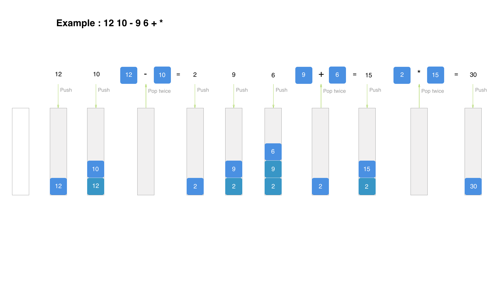

# Let's code a calculator 

## Warmup(15 min)

**BRANCH** 'no-hints' or 'hints' (there is no hints either)

Go to [WarmupCalculator](src/main/java/codeus/warmup/WarmupCalculator.java)

Provide code for calculator with "+" "-" "/" "*" operations with two numbers example:

For string inputs like 
"5 + 6", "6 / 2", "5 * 15" THERE IS ONLY ONE OPERATION ! 

You should return double value as a result of expression: "11.0", "3.0", "75.0" correspondently

Expect no invalid input, have fun

Check you solution [WarmupCalculatorTest](src/test/java/codeus/warmup/WarmupCalculatorTest.java)

## Main assignment(45 min) 

In group of 2/3 developers try to implement a [Calculator](src/main/java/codeus/assignment/Calculator.java) class that should meet next requirements(each next level should meet all requirements in previous levels): 

Level 1: WarmupCalculator requirements 

Level 2: Exception on invalid input [InvalidCalculusTokenException](src%2Fmain%2Fjava%2Fexception%2FInvalidCalculusTokenException.java) when there is unsupported symbol in expression and [DivisionByZeroException](src%2Fmain%2Fjava%2Fexception%2FDivisionByZeroException.java) if there is a division by zero in the expression

Level 3: Support multi operational expressions without mixing "* /" and "+ -" example input "3 + 5 + 6 - 9", "8 * 9 / 3" THERE COULD BE MANY OPERATIONS WITHOUT PRIORITY CLASH

Level 4: support mixed operations and parentheses example input "1 + ( 6 + 9 ) / 3"

Check your solution: [CalculatorTest](src/test/java/codeus/assignment/CalculatorTest.java)
### Branches
1) **no-hints** - world for try-hards at 7:30 
2) **hints** - some hints for main task implementation
3) **completed** - branch with completed solution with level 4 requirements(more about it later)

Useful links:
https://aquarchitect.github.io/swift-algorithm-club/Shunting%20Yard/ Brief algorithm explanation
https://view.officeapps.live.com/op/view.aspx?src=https%3A%2F%2Fpeople.cs.vt.edu%2F~shaffer%2FAVCourse%2FShuntingYard.ppt&wdOrigin=BROWSELINK step by step example 

Postfix calculation example

If you feel that you are stuck try to make atomic requests to chat gpt